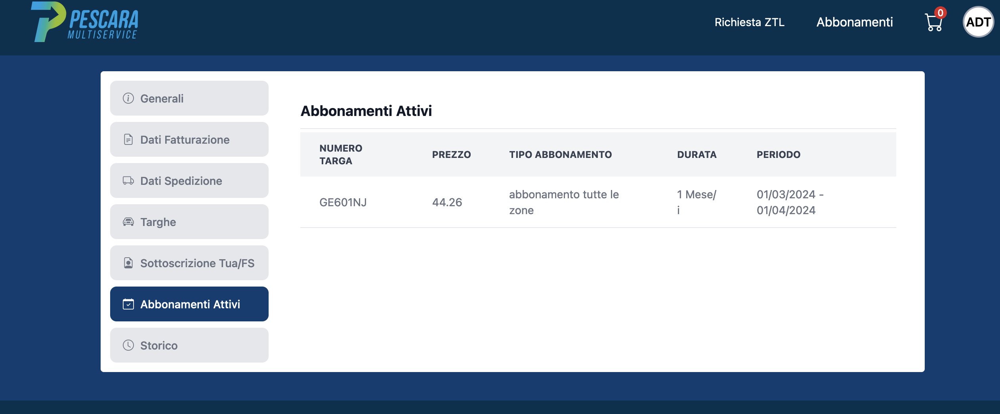

Prove ...

This is a red word in a sentence

<a href="{{ site.baseurl }}/it/I/1">that chapter</a>

<a href="{{ site.baseurl }}/it/I/1/2">that section</a>

<a href="{{ site.baseurl }}/it/I/1/2#SUBSEC_MU-it">that heading</a>

<a href="{{ site.baseurl }}/it/I/1/1#gr_1-1-1">Figura 1.1.1</a>

<a href="{{ site.baseurl }}/it/I/1/1#gr_wtp2">Figura 1.1.3</a>

<a href="{{ site.baseurl }}/it/I/1/4#gr_CV-CS">Figura 1.4.1</a>

Here is a picture. It must be put in the same folder as this md file (I think).

Here is a graph ...



Here is another:



bla bla bla bla bla bla bla bla bla bla bla bla bla bla bla bla bla bla bla bla bla bla bla bla bla bla bla bla bla bla bla bla bla bla bla bla bla bla bla bla bla bla bla bla bla bla bla bla bla bla bla bla bla bla bla bla bla bla bla bla bla bla bla bla bla bla bla bla bla bla bla bla bla bla bla bla bla bla bla bla bla bla bla bla bla bla bla bla bla bla bla bla bla 
<label for="mn-demo" class="margin-toggle">&#8853;</label>
<input type="checkbox" id="mn-demo" class="margin-toggle"/>

  This is a margin note. Notice there isn’t a number preceding the note.

la bla bla bla bla bla bla bla bla bla bla bla bla bla bla bla bla bla bla bla bla bla bla bla bla bla bla bla bla bla bla bla 

bla bla bla bla bla bla bla bla bla bla bla bla bla bla bla bla bla bla bla bla bla bla bla bla bla bla bla bla bla bla bla bla bla bla bla bla bla bla bla bla bla bla bla bla bla bla bla bla bla bla bla bla bla bla bla bla bla bla bla bla bla bla bla bla bla bla bla bla bla bla bla bla bla bla bla bla bla bla bla bla<label for="sn-demo"
       class="margin-toggle sidenote-number">
</label>
<input type="checkbox"
       id="sn-demo"
       class="margin-toggle"/>

  This is a first side note. Notice there is a number preceding the note.

la bla bla bla bla bla bla bla bla bla bla bla bla bla bla bla bla bla bla bla bla bla bla bla bla bla bla bla bla bla bla bla bla bla bla bla bla bla bla bla bla bla bla bla bla bla bla bla bla bla bla bla bla bla bla bla bla bla bla bla bla bla bla bla bla bla bla bla bla bla bla bla bla bla bla bla bla bla bla bla bla bla bla bla bla bla bla bla bla bla bla bla bla bla bla bla bla bla bla bla bla bla bla bla bla bla bla bla bla bla bla bla b
<label for="sn-demo"
       class="margin-toggle sidenote-number">
</label>
<input type="checkbox"
       id="sn-demo"
       class="margin-toggle"/>

  This is a second margin note. Notice there isn’t a number preceding the note.

la bla bla bla bla bla bla bla bla bla bla bla bla bla bla bla bla bla bla bla bla bla bla bla bla bla bla bla bla bla bla bla bla bla bla bla bla bla bla bla bla bla bla bla bla bla bla bla bla bla bla bla bla bla bla bla bla bla bla bla bla bla bla bla bla bla bla bla bla bla bla bla bla bla bla bla bla bla bla bla bla bla bla bla bla bla bla bla bla bla bla bla bla bla bla bla
bla bla bla bla bla bla bla bla bla bla bla bla bla bla bla bla bla bla bla bla bla bla bla bla bla bla bla bla bla bla bla bla 

